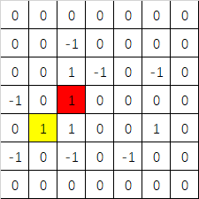

1828. Lake Escape

Albert is stranded on a frozen lake. He wants to know if he can make it back to shore. He is currently on a snowbank that gives him some traction, but once he steps the ice. he will slide in the same direction until he hits another snowbank. There are also treacherous holes in the ice that he must avoid.

As a cruel twist of fate, Albert's young pup, Kuna, is also stranded, but on a different snowbank. Can Albert reach his pup AND make it to shore?

Albert can only move horizontally and vertically. He makes it to shore by leaving the lake grid.

The input contains these parameters:

side_length: the length of a side of the lake (it's a square)
lake_grid: a 2D matrix representing the lake 0 = ice, 1 = snowbank, -1 = hole
albert_row: row of Alber'ts snowbank
albert_column: column of Albert's snowbank
kuna_row: row of Kuna's snowbank
kuna_column: column of Kuna's snowbank
Example
Input:
7
[[0,0,0,0,0,0,0],[0,0,-1,0,0,0,0],[0,0,1,-1,0,-1,0],[-1,0,1,0,0,0,0],[0,1,1,0,0,1,0],[-1,0,-1,0,-1,0,0],[0,0,0,0,0,0,0]]
4
1
3
2
Output: true
Explanation:

As it seen in the picture. Yellow ceil is Albert's location and red ceil is Kuna's location. Albert can turn right to (4,2) and up to (3,2) then turn right to leave the lake grid.

Challenge
Albert can't go to the shore and then find Kuna.

Notice
It is guaranteed
∣albert_row−kuna_row∣+∣albert_column−kuna_column∣>0。

解法1：

这道题感觉比较难。我起初的想法是用2步BFS(第1步先找狗，第2步离开)，但代码很冗长。后来看了标准答案发现用一次BFS就可用了，但要分2种状态(find dog or not)来处理。

注意：
1) visit数组为3维vector，第1维表示find dog or not，第2，3维分别代表map的x,y值。
2) queue也是3维，定义成pair中加pair。
3) 这题因为有个特殊条件就是一旦遇到冰面，可以就着原来方向一直滑下去，所以加了个
 for (int j = 0; j <= side_length; ++j) 
循环。如果里面遇到狗了当越界或遇到snow bank或hole就退出。注意如果找到狗了肯定也是在snow bank上面，可以同时更新2个状态并退出。
4) 退出来后就看现在是什么情况:
Case 1: 如果找到狗了又越界了就返回true。
Case 2: 如果没越界又遇到雪堆，则加入新节点，新节点的状态按find_dog_flag来处理。
还有其他状态如下，都属于不考虑的情况，继续循环即可。
Case 3: 越界了没找到狗
Case 4: 没越界又没碰到雪堆(snow bank)，那就是掉到雪坑(snow hole)里了。
