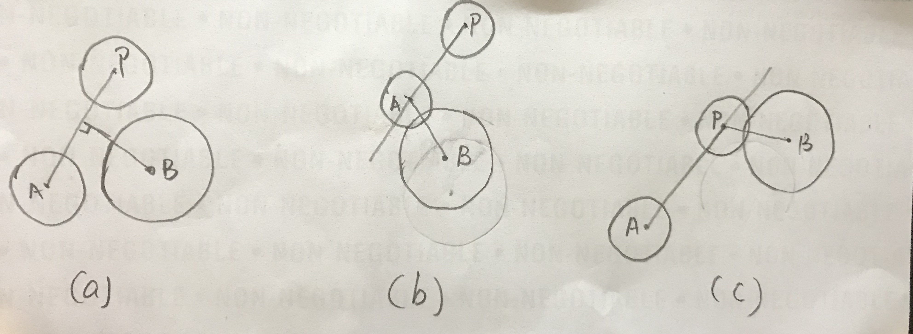

21. Moving Circle

The problem will give the center coordinates (x, y) and radius r of the two circles A and B.
Then the problem give you a point P ,and move the center of circle A to the point P along a straight line.
Will the circle A intersect with the circle B during the move? (The moving process includes the starting point and an ending point)
If it they intersect return 1, otherwise return -1.

Example
Example 1

input：[0,0,2.5,3,2,0.5,0,2]
output：1
explain：The center of circle A (0, 0) has a radius of 2.5, the center of circle B (3, 2) has a radius of 0.5, and the point P (0, 2). The moving is shown in the figure:

Example 2

input：[0,0,2,5,0,1,0,2]
output：-1
explain：The center of circle A (0, 0) has a radius of 2, the center of circle B (5,0) has a radius of 1, and the point P (0, 2). 
Notice
The radius of both circles does not exceed 10000.
The absolute value of the abscissa and ordinate values does not exceed 10000.
The list in input represent [X_A, Y_A, R_A, X_B, Y_B, R_B, X_P, Y_P].

解法1：

