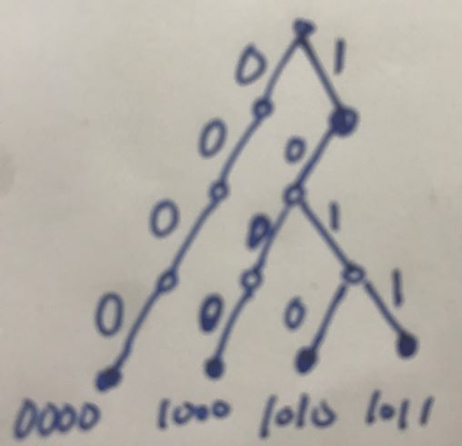
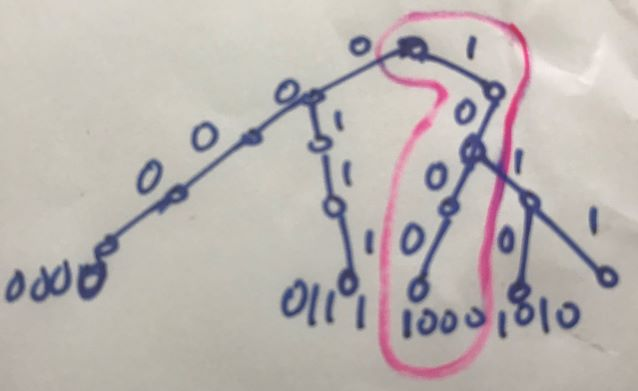

722. Maximum Subarray VI

Given an array of integers. find the maximum XOR subarray value in given array.

What's the XOR: https://en.wikipedia.org/wiki/Exclusive_or

Example
Example 1

Input: [1, 2, 3, 4]
Output: 7
Explanation:
The subarray [3, 4] has maximum XOR value
Example 2

Input: [8, 1, 2, 12, 7, 6]
Output: 15
Explanation:
The subarray [1, 2, 12] has maximum XOR value
Example 3

Input: [4, 6]
Output: 6
Explanation:
The subarray [6] has maximum XOR value
Notice
Expected time complexity O(n).

解法1：Trie+XOR。

用Trie和异或的解法我感觉非常难，看答案也是看了很久才看明白。下面这两个链接讲得非常不错。

https://www.geeksforgeeks.org/find-the-maximum-subarray-xor-in-a-given-array/

https://lengerrong.blogspot.com/2017/11/maximum-subarray-vi.html

首先，我们感觉好像用XOR的话，就不能有presum这样的数组了，但是实际上是可以有的，因为XOR有下面的特性:

prexor(L,R) = prexor(1,R) ^ prexor(1,L-1), prexor(L,R) is XOR of subarray from L to R。所以我们可以建立类似的prexor数组，即prexor[i]=F(1, i)。

另外，为什么要用Trie呢？这样就可以节省时间了，可以在O(n)的时间内找出前面的数字的prexor。

以输入A[]= {8, 2, 1, 12}为例。为简便起见，假设A数组从1开始，假定prexor[0] = 0。易知prexor[1] = 8 (1010)，prexor[2]= 10 (1010), prexor[3] = 11 (1011)。

每来一个A[i]，我们将prexor[i]插入trie树中。下图是A[3]=1来后的情形。

注意，每次插入A[i]后我们还要调用query()函数返回当前能找到的最大的那个XOR值。那么这个最大的XOR值怎么找呢？利用prexor(L,R) = prexor(1,R) ^ prexor(1,L-1)。我们已经知道prexor(1,R)，那么，我们只要在trie树上找到之前能和prexor(1,R)异或出最大结果的那个prexor(1,L-1)即可。因为在trie树上已经存了所有prexor(1,i), i=1,...,R-1的值。我们的任务就是要在prexor[1,...,R-1]中找到一个最优的数prexor[X], 使得prexor(1,R)^prexor(1,X)最大，这里的X就是L-1，那么这个最大值就是题目所求的最大XOR subarray的值。

下图是A[4]=12来后的情形。

prexor=7(0b0111)已经插入trie中，我们要在trie中找到一个最优的prexor[i]，使得其与0b0111异或出来最大。注意prexor[i]的值都存在叶子节点中。我们可以看到找到的最优的prexor[i]是prexor[1]=8(0b1000)，而这个最大值就是7 XOR 8 = 15 (0b1111), 因为X=1，这个subarray就是A[2..4]，注意2=X+1。

怎么找最大的prexor[i]的关键在于query里面的算法：

        // Find current bit in given prefix 
        bool val = pre_xor & (1 << i); 
  
        // Traverse Trie, first look for a 
        // prefix that has opposite bit 
        if (temp->arr[1 - val] != NULL) 
            temp = temp->arr[1 - val]; 
  
        // If there is no prefix with opposite 
        // bit, then look for same bit. 
        else if (temp->arr[val] != NULL) 
            temp = temp->arr[val]; 

从高到低遍历bit，每次先找跟prexor的对应bit相反的bit，找不到才找相同的bit。为什么先找相反的bit呢？就是为了让XOR值最大嘛！